# Typa（タイパ）の つかいかた

## Typa（タイパ）で できること

Typa は、キーボードで 文字を <ruby>打<rt>う</rt></ruby>つ れんしゅうを する アプリです。ここでは、なにが できるのかと、はじめる まえに <ruby>用意<rt>ようい</rt></ruby>する ものを せつめいします。

### Typa は どんな アプリ？

ブラウザで ひらくだけで つかえる、タイピングの れんしゅう アプリです。アプリを ダウンロードしたり、名前や あいことばを つくったりする ひつようは ありません。

ひらいた <ruby>画面<rt>がめん</rt></ruby>が、そのまま <ruby>打<rt>う</rt></ruby>つ <ruby>画面<rt>がめん</rt></ruby>です。「はじめる」の ボタンは ありません。キーを たたけば、その ばで れんしゅうが はじまります。なにを <ruby>打<rt>う</rt></ruby>つかは アプリが きめて 出すので、えらばなくて だいじょうぶです。

中に 入って いるのは、5つの コースと 32の ステージです。ゆびの ばしょを おぼえる ところから はじめて、ローマ字、ことば、文、そして コピーや はりつけの ショートカットまで すすみます。そのほかに、時間の 中で どれだけ <ruby>打<rt>う</rt></ruby>てるかを ためす「チャレンジ」と、まちがえやすい キーだけを あつめた「にがて とっくん」が あります。

<ruby>打<rt>う</rt></ruby>った きろくは、じぶんの <ruby>端末<rt>たんまつ</rt></ruby>の 中にだけ のこります。名前や <ruby>出席<rt>しゅっせき</rt></ruby>ばんごうを 入れる ところは ありません。インターネットに おくる ことも ありません。

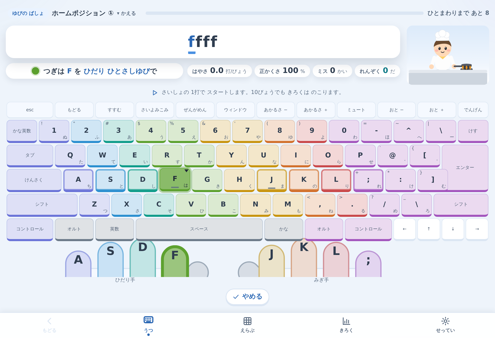

ひらいた ときの <ruby>画面<rt>がめん</rt></ruby>です。もう <ruby>打<rt>う</rt></ruby>てる じょうたいに なって います。

### つかう人と、<ruby>用意<rt>ようい</rt></ruby>する もの

つかうのは、キーボードを れんしゅうする みなさんです。先生だけが つかう ところも すこし ありますが、そこには「先生むけ」「先生へ」と 書いて あります。

はじめる まえに、つぎの ものが 手もとに あるか たしかめて ください。

1. キーボードの ついた Chromebook か パソコン。タブレットでも つかえますが、キーボードを つないで ください。
2. インターネットに つながって いる こと。さいしょの 1回だけ ひつようです。
3. ひらく ところ（アドレス）… `https://typa.giga-school.com/`

ID や パスワードは いりません。アカウントを つくる ひつようも ありません。

## はじめて ひらく ときに する こと（さいしょの 1回だけ）

さいしょの 1回だけ、やって おくと いい ことが 3つ あります。2つめは、キーを おしても すすまない ときの いちばん おおい げんいんです。

### ブラウザで アドレスを ひらく

Chrome などの ブラウザを ひらいて、上の アドレスの ところに つぎの ように <ruby>打<rt>う</rt></ruby>って、エンターキーを おして ください。

```
https://typa.giga-school.com/
```

すぐに <ruby>打<rt>う</rt></ruby>つ <ruby>画面<rt>がめん</rt></ruby>が 出ます。「はじめる」を おす ひつようは ありません。

さいしょの 1回は、かならず インターネットに つながった ところで ひらいて ください。その ときに アプリ ぜんぶが <ruby>端末<rt>たんまつ</rt></ruby>の 中に 入ります。つぎからは、つながって いなくても つかえます。

### ローマ字が <ruby>打<rt>う</rt></ruby>てる ように する（かな入力を 切る）

日本語入力（かな入力）に なって いると、キーを おしても <ruby>画面<rt>がめん</rt></ruby>が すすみません。かなが 出て きたら、つぎの どちらかの キーを 1回 おして ください。

1. かな<ruby>英数<rt>えいすう</rt></ruby>キー … キーボードの「1」の すぐ 左に あります。
2. <ruby>英数<rt>えいすう</rt></ruby>キー … スペースキーの すぐ 左に あります。

かな入力の ままで <ruby>打<rt>う</rt></ruby>つと、<ruby>画面<rt>がめん</rt></ruby>に つぎの おしらせが 出ます。


この 赤い おしらせが 出たら、上の キーを おします。

### Chromebook や タブレットに アプリとして 入れて おく

ホーム<ruby>画面<rt>がめん</rt></ruby>に 入れて おくと、ブラウザの バーが <ruby>消<rt>き</rt></ruby>えて <ruby>画面<rt>がめん</rt></ruby>が 広く なり、つぎから すぐ ひらけます。入れ かたは <ruby>端末<rt>たんまつ</rt></ruby>に よって ちがいます。

1. Chromebook・Windows（Chrome / Edge）… アドレスの ところの 右はしに 出る インストールの しるしを おします。せってい →「データ」の 中に ある「ホーム<ruby>画面<rt>がめん</rt></ruby>に 入れる」から でも できます。
2. iPad・iPhone … Safari で ひらいて、<ruby>共有<rt>きょうゆう</rt></ruby>ボタン（□に ↑ の しるし）→「ホーム<ruby>画面<rt>がめん</rt></ruby>に<ruby>追加<rt>ついか</rt></ruby>」→「<ruby>追加<rt>ついか</rt></ruby>」と おします。iPad には Chrome のような インストールの ボタンが ないので、かならず Safari で ひらいて ください。
3. Android … メニュー →「アプリをインストール」または「ホーム<ruby>画面<rt>がめん</rt></ruby>に<ruby>追加<rt>ついか</rt></ruby>」を おします。

【！】おぼえて おいて ほしい こと

- 入れなくても、ブラウザの ままで ぜんぶ つかえます。
- 「ホーム<ruby>画面<rt>がめん</rt></ruby>に 入れる」の ボタンが 出ない ときは、もう 入って いるか、その ブラウザが たいおうして いません。
- 入れても、きろくは その <ruby>端末<rt>たんまつ</rt></ruby>の 中に のこった ままです。べつの <ruby>端末<rt>たんまつ</rt></ruby>には うつりません。

## うつ がめんの みかた

ひらいた ときに 出る「うつ」の <ruby>画面<rt>がめん</rt></ruby>には、上・まん中・下の 3つの ばしょが あります。どこに 何が あるかを おぼえて おくと、まよわなく なります。

### いちばん 上の バーに ある もの

いちばん 上には、いま やって いる コースと ステージの 名前、それに すすみぐあいの バーが 出ます。

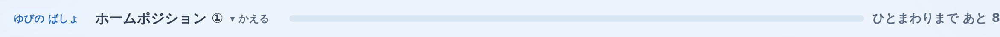

左に コースと ステージの 名前、右に のこりの お<ruby>題<rt>だい</rt></ruby>の 数が 出ます。

ステージの 名前の よこに「かえる」と 書いて あります。ここを おすと、ステージを えらぶ <ruby>画面<rt>がめん</rt></ruby>に いけます。「これじゃ ない」と 思った ときに つかいます。

右はしの「ひとまわりまで あと ◯」は、あと 何もん <ruby>打<rt>う</rt></ruby>つと ひとまわりに なるかを あらわして います。0に なると ★が つきます。

### まん中の お<ruby>題<rt>だい</rt></ruby>と、その 下の しらせ

まん中の 大きな 白い ところが お<ruby>題<rt>だい</rt></ruby>です。いま <ruby>打<rt>う</rt></ruby>つ ところに 下線が つきます。

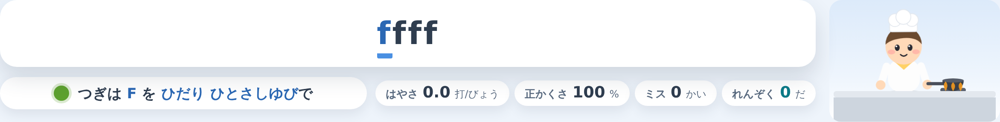

右がわの ちびキャラは、1もん <ruby>打<rt>う</rt></ruby>ちきる ごとに しごとを すすめます。

お<ruby>題<rt>だい</rt></ruby>の 下には「つぎは ◯ を ◯ゆびで」と 出ます。その 右に「はやさ」「正かくさ」「ミス」「れんぞく」の 4つの 数字が ならびます。はやさは 1びょうに 何回 <ruby>打<rt>う</rt></ruby>てて いるか、正かくさは まちがえずに <ruby>打<rt>う</rt></ruby>てた わりあいです。

### 下の バーに ある 5つの ボタン

<ruby>画面<rt>がめん</rt></ruby>の いちばん 下に、いつも 5つの ボタンが ならんで います。


左から もどる・うつ・えらぶ・きろく・せってい の 5つです。

1. もどる … 1つ 前の <ruby>画面<rt>がめん</rt></ruby>に もどります。<ruby>画面<rt>がめん</rt></ruby>の はしから 中へ スワイプしても、`Alt` と `←` を おしても 同じです。
2. うつ … <ruby>打<rt>う</rt></ruby>つ <ruby>画面<rt>がめん</rt></ruby>に いきます。つづきから はじまります。
3. えらぶ … コース・チャレンジ・にがて とっくんを えらぶ <ruby>画面<rt>がめん</rt></ruby>です。
4. きろく … これまでの あゆみを 見る <ruby>画面<rt>がめん</rt></ruby>です。
5. せってい … ヒントの つよさや 見た目を かえる <ruby>画面<rt>がめん</rt></ruby>です。

【！】おぼえて おいて ほしい こと

- どの <ruby>画面<rt>がめん</rt></ruby>でも スペースキーを おすと、<ruby>打<rt>う</rt></ruby>つ <ruby>画面<rt>がめん</rt></ruby>に もどれます。ボタンを さがさなくて だいじょうぶです。
- ただし、文字を 書く ところや スイッチの 上に カーソルが ある ときは、スペースキーは その ばの はたらきに なります。

## キーを <ruby>打<rt>う</rt></ruby>つ ときの きまり

<ruby>打<rt>う</rt></ruby>ちかたの きまりは 3つ だけです。ここが 分かれば、あとは ずっと 同じ やりかたで すすめます。

### 光って いる キーを、同じ 色の ゆびで <ruby>押<rt>お</rt></ruby>す

<ruby>画面<rt>がめん</rt></ruby>の 下に、キーボードの 絵と <ruby>両手<rt>りょうて</rt></ruby>の 絵が 出て います。つぎに <ruby>打<rt>う</rt></ruby>つ キーが 光るので、その キーを おします。

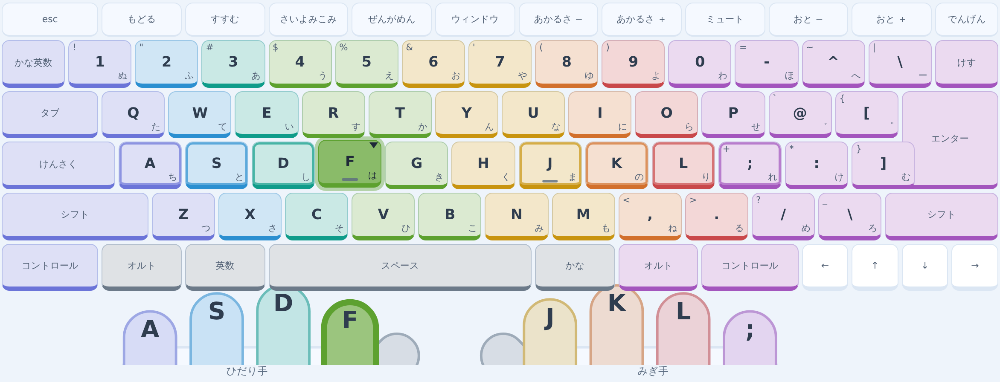

キーの 色は ゆびの 色です。同じ 色の ゆびで おします。

お<ruby>題<rt>だい</rt></ruby>の 下の ことばも、同じ ことを 教えて くれます。


「つぎは F を ひだり ひとさしゆびで」と 出ます。

シフトが いる キーの ときは、<ruby>打<rt>う</rt></ruby>つ 手と <ruby>反対<rt>はんたい</rt></ruby>の 小ゆびも いっしょに 光ります。かた手で おさない ためです。

ホームポジションは、左手を F、右手を J に おく ばしょです。この 2つの キーには でっぱりが あるので、見なくても さわれば 分かります。

### まちがえると すすまない

まちがえた キーを おしても、お<ruby>題<rt>だい</rt></ruby>は 先へ すすみません。あわてずに、正しい キーを さがして ください。


まちがえると お<ruby>題<rt>だい</rt></ruby>の わくが 赤く なり、「ミス」の 数が 1 ふえます。

まちがえても きろくは <ruby>消<rt>き</rt></ruby>えません。うしろに もどる ことも ありません。

### 同じ お<ruby>題<rt>だい</rt></ruby>で 4回 まちがえたら「とばす」

同じ お<ruby>題<rt>だい</rt></ruby>で 4回 まちがえると、<ruby>画面<rt>がめん</rt></ruby>の 下に「この お<ruby>題<rt>だい</rt></ruby>を とばす」と いう ボタンが 出ます。

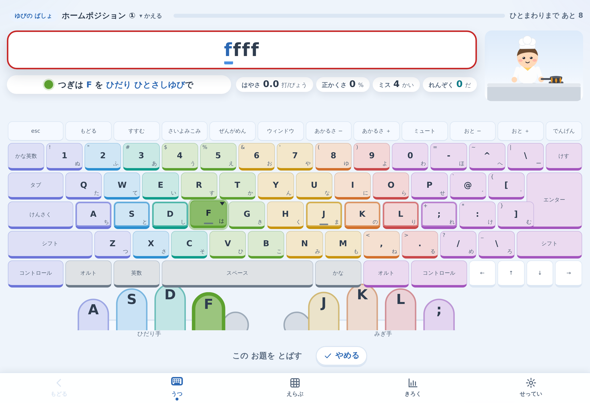

下の ほうに「この お<ruby>題<rt>だい</rt></ruby>を とばす」が 出ます。

1つの キーの ところで ずっと 手が 止まらない ように する ための ボタンです。おすと、つぎの お<ruby>題<rt>だい</rt></ruby>に すすみます。とばした ことは きろくに のこるので、あとで「にがて とっくん」に 出て きます。

## ひとまわりと ★の つきかた

ステージには「おわり」が ありません。かわりに「ひとまわり」と いう <ruby>区切<rt>くぎ</rt></ruby>りが あって、そこで ★が つきます。

### ひとまわりって なに？

ステージに 入って いる お<ruby>題<rt>だい</rt></ruby>の 数だけ <ruby>打<rt>う</rt></ruby>つと、1しゅう したと いう ことで「ひとまわり」に なります。ひとまわりする たびに ★が つきます。

とちゅうで やめても、<ruby>打<rt>う</rt></ruby>った ぶんは <ruby>消<rt>き</rt></ruby>えません。3もんだけ <ruby>打<rt>う</rt></ruby>って やめても すすみに たまり、つぎに ひらくと その つづきから 出ます。だから 10びょうでも、何十分でも、同じ ように つかえます。

★は、はやさでは なく 正かくさで つきます。

1. ★3つ … 正かくさ 98% いじょう。または まちがいが 1回まで。
2. ★2つ … 正かくさ 92% いじょう。または まちがいが 2回まで。
3. ★1つ … 正かくさ 80% いじょう。または まちがいが 3回まで。

<ruby>一度<rt>いちど</rt></ruby> ついた ★は、つぎに うまく いかなくても 下がりません。

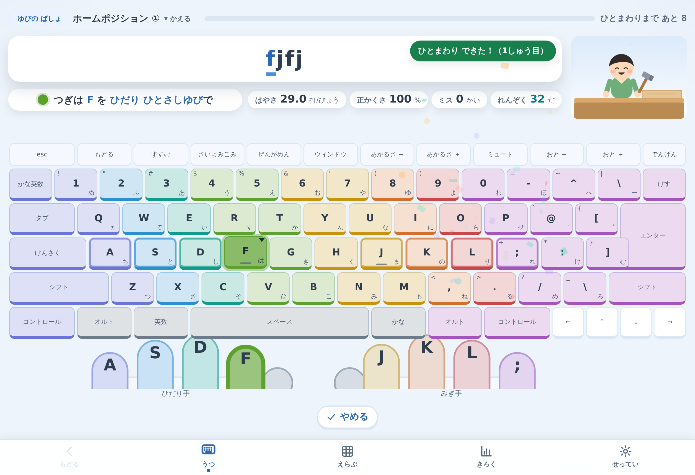

「★3つ！」の しらせが 2びょうほど 出ます。<ruby>打<rt>う</rt></ruby>つのは 止まりません。

### ★3つに なると、その ばで つぎの ステージへ

ひとまわりして ★3つに なると、その ばで つぎの ステージに 入れかわります。「おわりました」の <ruby>画面<rt>がめん</rt></ruby>は はさみません。お<ruby>題<rt>だい</rt></ruby>と ステージの 名前が かわって、そのまま <ruby>打<rt>う</rt></ruby>ちつづけられます。

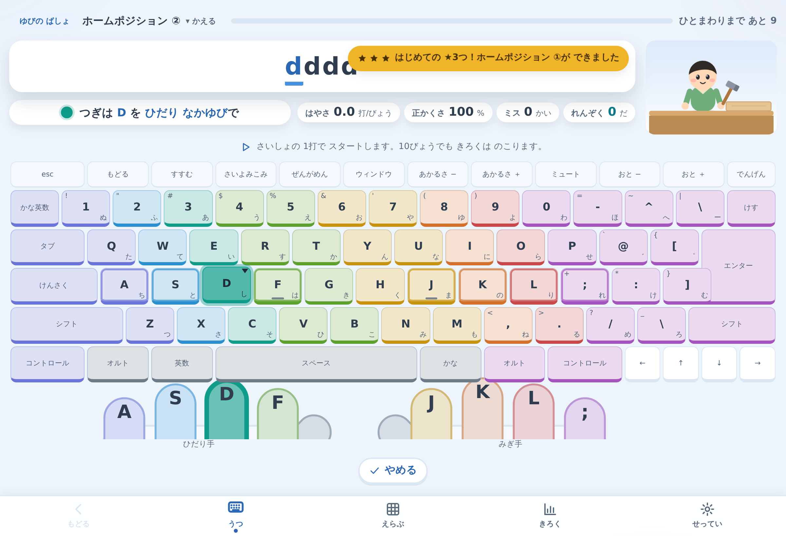

「★3つ！ ◯◯が できました」と 出て、つぎの ステージに かわります。

入れかわるのは 1もん <ruby>打<rt>う</rt></ruby>ち<ruby>終<rt>お</rt></ruby>えた ところなので、<ruby>打<rt>う</rt></ruby>ちかけの ことばが とり上げられる ことは ありません。行き先は、まだ ★3つに なって いない いちばん 近い ステージです。

【！】おぼえて おいて ほしい こと

- ぜんぶの ステージが ★3つに なると、それいじょうは 入れかわりません。
- けっか<ruby>画面<rt>がめん</rt></ruby>の「もう1かい」や、じぶんで えらんで 入った ときは 入れかわりません。じぶんで きめた ことを とり上げない ためです。
- チャレンジと にがて とっくんでは ★は つきません。

## れんしゅうを やめて、けっかを 見る

<ruby>打<rt>う</rt></ruby>つのを おわりに する ときは「やめる」を おします。おした ところまでの きろくが のこり、けっかの <ruby>画面<rt>がめん</rt></ruby>が 出ます。

### けっかの がめんに 出る 数字

<ruby>画面<rt>がめん</rt></ruby>の いちばん 下に ある「やめる」を おすと、けっかの <ruby>画面<rt>がめん</rt></ruby>に かわります。

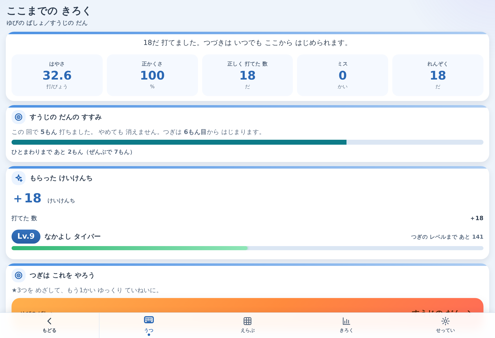

★・はやさ・正かくさ・ミス・れんぞくが ならびます。

1. はやさ … 1びょうに 何回 <ruby>打<rt>う</rt></ruby>てたか（<ruby>打<rt>だ</rt></ruby>／びょう）です。
2. 正かくさ … まちがえずに <ruby>打<rt>う</rt></ruby>てた わりあい（%）です。
3. 正しく <ruby>打<rt>う</rt></ruby>てた 数 … その 回に 正しく おした キーの 数です。
4. ミス … まちがえた 回数です。
5. れんぞく … つづけて 正しく <ruby>打<rt>う</rt></ruby>てた いちばん 長い 数です。

下の ほうには、ふえた けいけんち、もらった バッジ、そして「つぎは これを やろう」が 出ます。いちばん 下の 3つの ボタンで、もう1かい やるか、つぎの ステージへ いくか、コースに もどるかを えらべます。

### 「くわしく 見る」で どこで 手が とまったかを 見る

けっかの <ruby>画面<rt>がめん</rt></ruby>の まん中あたりに ある「くわしく 見る」を おすと、たたんで あった ところが ひらきます。

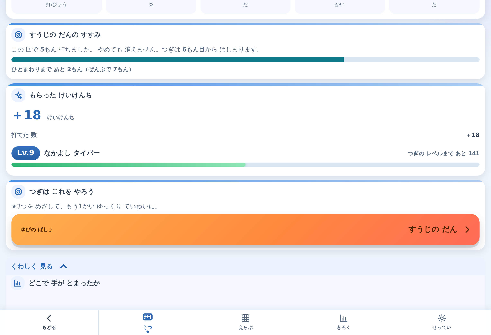

1<ruby>打<rt>だ</rt></ruby>ずつの グラフと、にがてな キーの まとめが 出ます。

グラフの よこは <ruby>打<rt>う</rt></ruby>った じゅんばん、たては その 1<ruby>打<rt>だ</rt></ruby>に かかった 時間です。高く なって いる ところが、手が 止まった ところです。まちがえた ところは 色と 形の りょうほうで 分かるように なって います。

## 「えらぶ」から やる ことを きめる

下の バーの「えらぶ」を おすと、ほかの ことを やりたい ときの 入口が ならびます。

### えらぶ がめんに ならぶ もの

えらぶ の <ruby>画面<rt>がめん</rt></ruby>は、左と 右で <ruby>役<rt>やく</rt></ruby>わりが 分かれて います。左には いま やって いる ところ、右には ほかの れんしゅうへの 入口が ならびます。

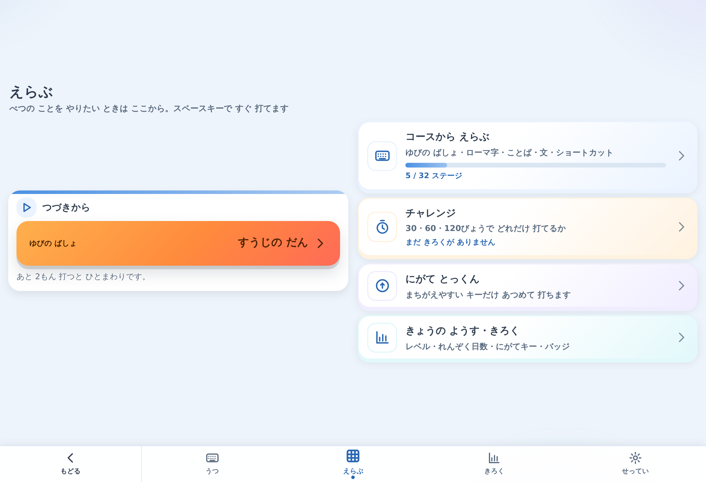

上に いま やって いる ところ、下に 4つの 行が ならびます。

1. コースから えらぶ … 5つの コースと 32の ステージから えらびます。
2. チャレンジ … 時間の 中で どれだけ <ruby>打<rt>う</rt></ruby>てるかを ためします。
3. にがて とっくん … まちがえやすい キーだけを あつめて <ruby>打<rt>う</rt></ruby>ちます。
4. きょうの ようす・きろく …「きろく」の <ruby>画面<rt>がめん</rt></ruby>に いきます。

ふくしゅうの 日が 来て いる ときと、とちゅうの ステージが ある ときは、その カードが いちばん 上に 出ます。

### コースから ステージを えらぶ

「コースから えらぶ」を おすと、5つの コースが ならびます。

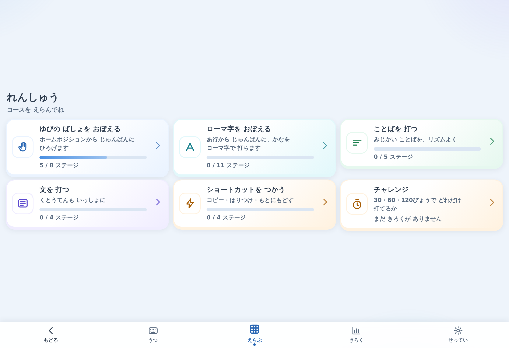

コースごとに、いくつ クリアしたかが 出ます。

1. ゆびの ばしょを おぼえる … ホームポジションから 上の だん・下の だん・すうじ・きごうまで。8ステージ。
2. ローマ字を おぼえる … あ行から わ行、てんてん、ん、ちいさい つ、ちいさい や ゆ よまで。11ステージ。
3. ことばを <ruby>打<rt>う</rt></ruby>つ … みのまわり・がっこう・まなび・コンピュータ・地名の ことば。5ステージ。
4. 文を <ruby>打<rt>う</rt></ruby>つ … あいさつ・にっき・ふり<ruby>返<rt>かえ</rt></ruby>り・ながい 文。4ステージ。
5. ショートカットを つかう … コピー・はりつけ・もとにもどす・えらぶ・べんりな キー。4ステージ。

コースを おすと、その 中の ステージが ならびます。

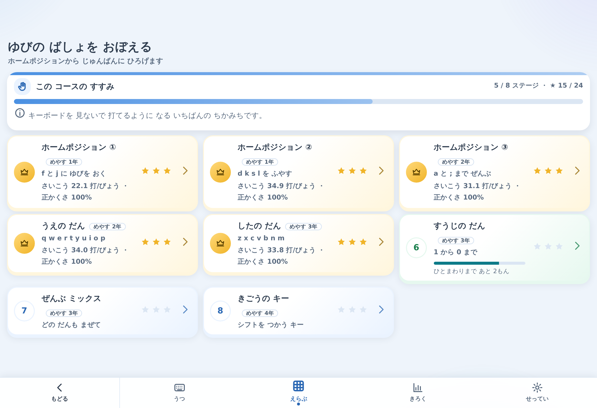

ステージごとに ★の 数と、めやすの 学年が 出ます。

<ruby>打<rt>う</rt></ruby>ちたい ステージを おすと、その ばで <ruby>打<rt>う</rt></ruby>つ <ruby>画面<rt>がめん</rt></ruby>に かわります。まだ やって いない ステージも えらべます。

## きょうの ふくしゅうを する

<ruby>一度<rt>いちど</rt></ruby> できた ところも、日が たつと わすれます。Typa は、ちょうど わすれかけた ころに もう<ruby>一度<rt>いちど</rt></ruby> 出して くれます。

### ふくしゅうは ひらいた ときに いちばん さきに 出る

ふくしゅうの 日が 来て いる ステージが ある ときは、アプリを ひらいた ところに その ステージが 出ます。「えらぶ」の <ruby>画面<rt>がめん</rt></ruby>にも、いちばん 上に 出ます。

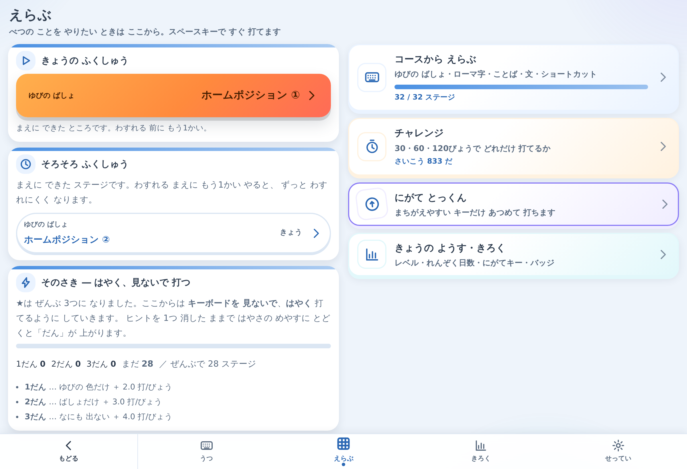

「きょうの ふくしゅう」として、いちばん 上に 出ます。

ふくしゅうを さきに 出すのは、日づけで きまるのが ふくしゅうだけ だからです。とちゅうの ステージは、あした つづきを <ruby>打<rt>う</rt></ruby>っても 同じ <ruby>結果<rt>けっか</rt></ruby>に なります。だから、その日に やらないと <ruby>損<rt>そん</rt></ruby>を する ものから 先に 出す ように して あります。

ふくしゅうの ステージは、ふつうの ステージと まったく 同じ ように <ruby>打<rt>う</rt></ruby>ちます。★も つきますし、けいけんちも たまります。ちがうのは、出て くる じゅんばんだけです。

ふくしゅうが 2つ いじょう たまって いる ときは、2つ目からは「えらぶ」の <ruby>画面<rt>がめん</rt></ruby>に ならびます。いそいで いる ときは、1つ だけ やって おわりにしても かまいません。のこりは また あした 出ます。

### 間を のばしながら 出る しくみ

★2つ いじょうで ひとまわり できると、つぎに 出る 日が だんだん 先に なって いきます。

1. 1回目の あと … 1日 あと
2. 2回目の あと … 3日 あと
3. 3回目の あと … 7日 あと
4. 4回目の あと … 14日 あと
5. 5回目の あと … 30日 あと

ひとまわりの ★が 1つ いがいの ときは、はこが 1に もどって、また あした 出ます。おぼえて いる ものほど 間が あくので、少ない 回数で わすれずに いられます。

しばらく Typa を ひらかなかった ときは、7日 いじょう さわって いない ステージも ふくしゅうに よばれます。ひさしぶりに ひらくと たくさん 出て くるのは その ためです。

【！】おぼえて おいて ほしい こと

- ふくしゅうの ステージを とばしても、きろくは <ruby>消<rt>き</rt></ruby>えません。つぎに ひらいた ときに また 出ます。
- ふくしゅうを して いる あいだも、★3つに なれば つぎの ステージに 入れかわります。
- どの ステージが ふくしゅうに 出るかは アプリが きめます。じぶんで えらぶ ことは できません。

## にがて とっくんで、まちがえた キーだけ <ruby>打<rt>う</rt></ruby>つ

まちがえやすい キーを 見つけて、その キーだけを あつめた お<ruby>題<rt>だい</rt></ruby>を その ばで つくります。お<ruby>題<rt>だい</rt></ruby>は さいだい 16もんで、90びょうくらいで おわります。

### つかえるように なる とき

にがて とっくんは、はじめから つかえる わけでは ありません。まちがえた キーが 2つ たまるか、とりちがえが 1くみ たまると えらべるように なります。

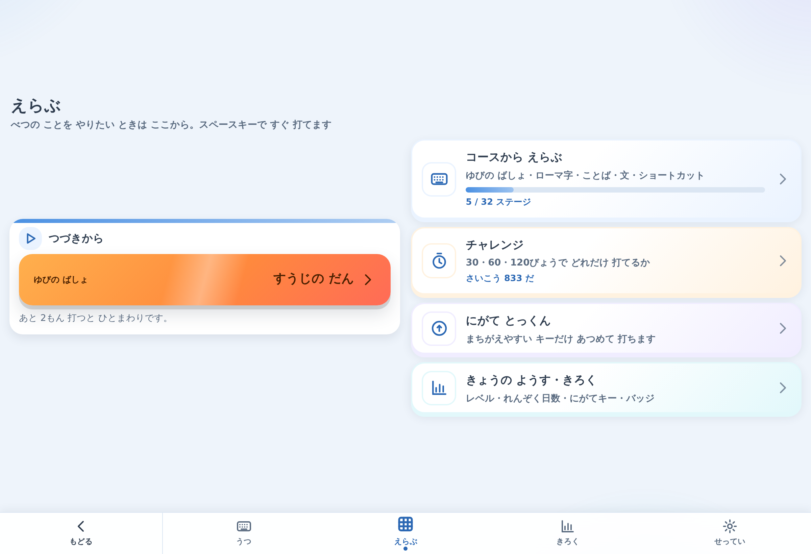

まだ つかえない ときは、うすい 色で「すこし れんしゅうすると つかえます」と 出ます。

すこし <ruby>打<rt>う</rt></ruby>てば すぐに たまるので、まずは ふつうに れんしゅうして ください。

### にがて とっくんを はじめる

「にがて とっくん」を おすと、すぐに <ruby>打<rt>う</rt></ruby>つ <ruby>画面<rt>がめん</rt></ruby>に かわります。

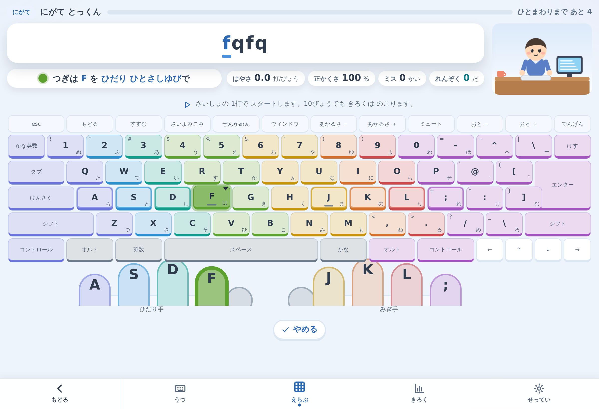

にがてな キーだけを ならべた お<ruby>題<rt>だい</rt></ruby>が 出ます。

<ruby>打<rt>う</rt></ruby>ち<ruby>終<rt>お</rt></ruby>わると、けっかの <ruby>画面<rt>がめん</rt></ruby>に かわります。

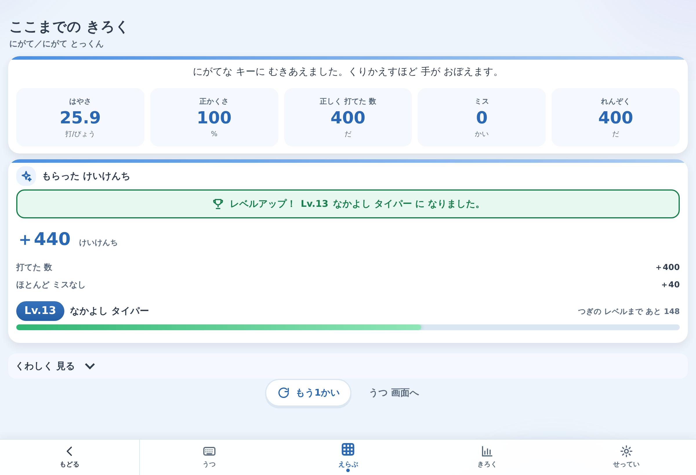

にがて とっくんでは ★は つきませんが、けいけんちは たまります。

【！】おぼえて おいて ほしい こと

- にがて とっくんに ★は つきません。ステージの ★は かわりません。
- 出て くる お<ruby>題<rt>だい</rt></ruby>は、その ときの きろくから 毎回 つくられます。同じ ものが 出るとは かぎりません。
- 5回 やると「にがて つぶし」の バッジが もらえます。

## チャレンジで、じかんの 中で どれだけ <ruby>打<rt>う</rt></ruby>てるか ためす

きめられた 時間の 中で、どれだけ 正しく <ruby>打<rt>う</rt></ruby>てるかを ためす あそびです。ステージの ★には えいきょうしません。

### じかんと <ruby>打<rt>う</rt></ruby>つ ものを えらぶ

「えらぶ」→「チャレンジ」と おすと、えらぶ <ruby>画面<rt>がめん</rt></ruby>が 出ます。

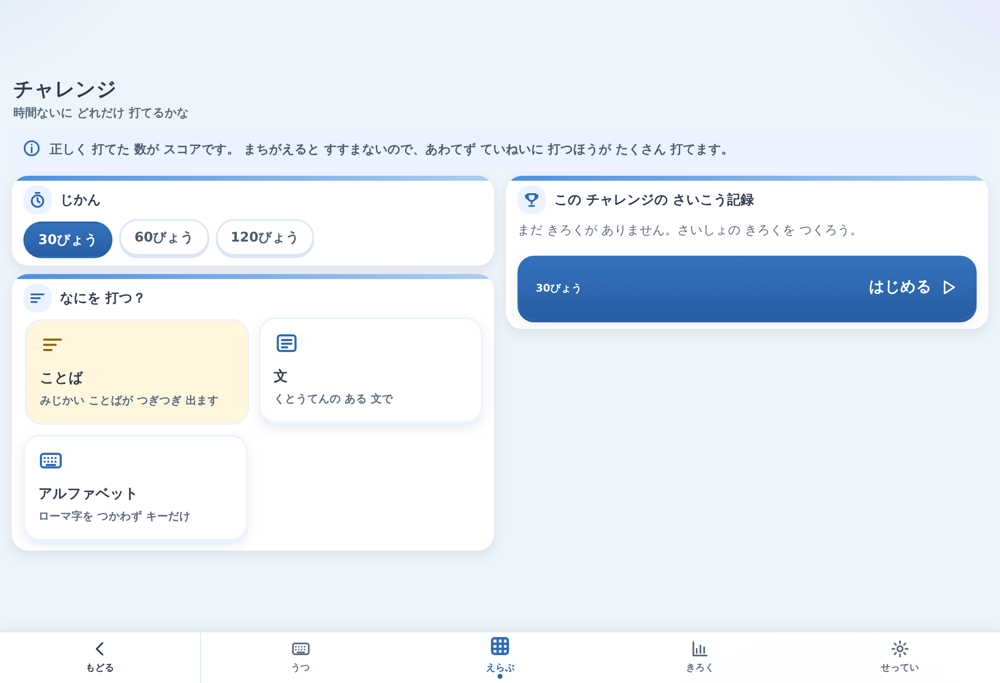

上で 時間を、まん中で <ruby>打<rt>う</rt></ruby>つ ものを えらびます。

1. じかん … 30びょう・60びょう・120びょうの 3つから えらびます。
2. なにを <ruby>打<rt>う</rt></ruby>つ？ … ことば・文・アルファベットの 3つから えらびます。
3. さいこう<ruby>記録<rt>きろく</rt></ruby> … その くみあわせで いちばん よかった きろくが 出ます。

えらんだら、いちばん 下の「はじめる」を おします。

### チャレンジを はじめる

はじめると、上の バーが 時間の のこりに かわります。

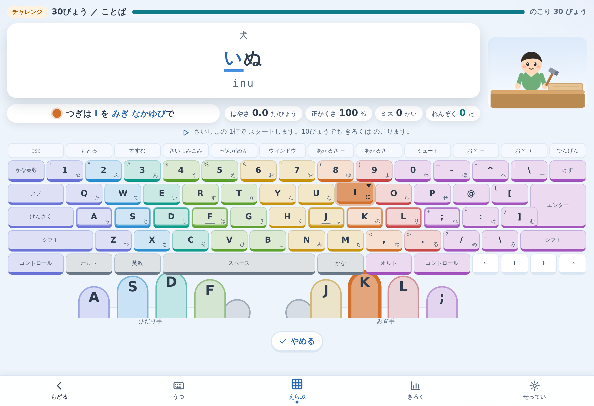

上の バーが へって いき、のこりの びょう数が 出ます。

正しく <ruby>打<rt>う</rt></ruby>てた 数が スコアです。まちがえると すすまないので、あわてず ていねいに <ruby>打<rt>う</rt></ruby>つ ほうが たくさん <ruby>打<rt>う</rt></ruby>てます。

時間が 来ると、その ばで けっかの <ruby>画面<rt>がめん</rt></ruby>に かわります。

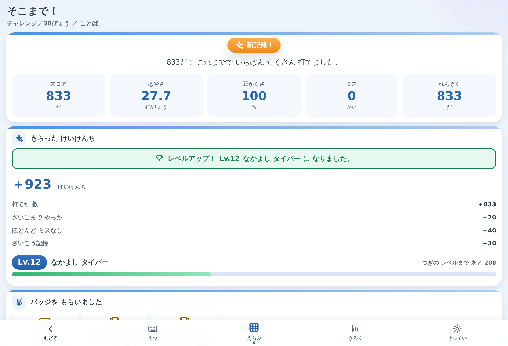

スコア・はやさ・正かくさが 出ます。さいこう<ruby>記録<rt>きろく</rt></ruby>なら「<ruby>新記録<rt>しんきろく</rt></ruby>！」と 出ます。

## ショートカットの ステージで、コピーと はりつけを おぼえる

ショートカットの コースだけは、ほかと <ruby>打<rt>う</rt></ruby>ちかたが ちがいます。キーを <ruby>打<rt>う</rt></ruby>つのでは なく、じっさいに 文を コピーしたり はりつけたり します。

### ショートカットの ステージの みかた

「コースから えらぶ」→「ショートカットを つかう」を おすと、4つの ステージが ならびます。

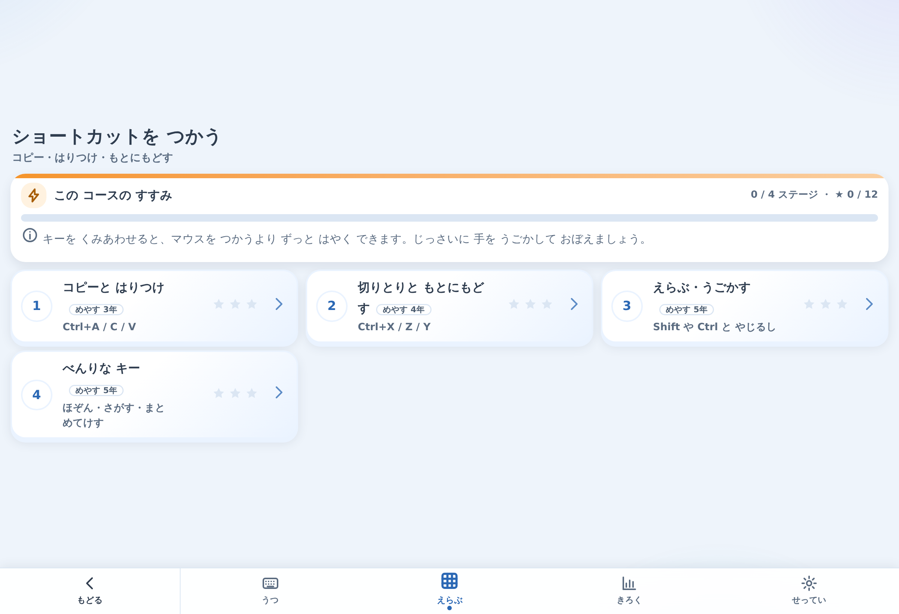

コピー・切りとり・えらぶ・べんりな キーの 4つが あります。

ステージを おすと、上に やる ことが 1つ 出て、下に「もとの文」と「じぶんの文」と いう 2つの 入力らんが 出ます。

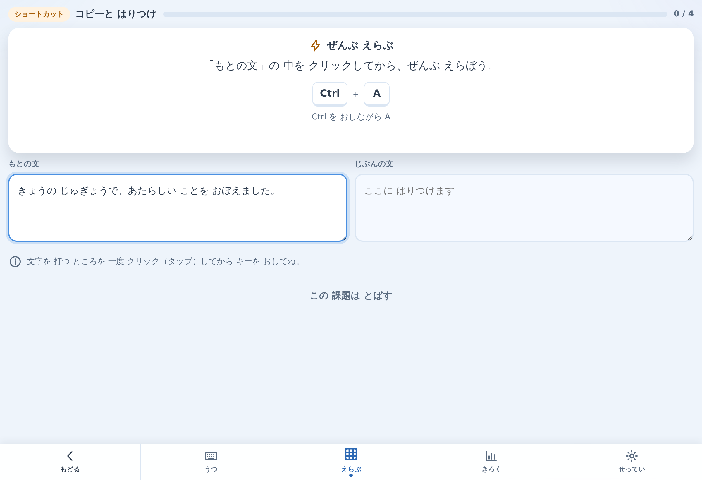

上に <ruby>押<rt>お</rt></ruby>す キー、下に <ruby>本物<rt>ほんもの</rt></ruby>の 入力らんが 2つ 出ます。

### じっさいに コピーして はりつける

たとえば「コピーと はりつけ」の ステージでは、つぎの じゅんばんで やります。

1. 「もとの文」の 中を 1回 クリック（タップ）します。文字を <ruby>打<rt>う</rt></ruby>つ ところを えらんで いないと、キーが とどきません。
2. `Ctrl` を おしながら `A` を おします。もとの文が ぜんぶ えらばれます。
3. `Ctrl` を おしながら `C` を おします。えらんだ 文が コピーされます。
4. 「じぶんの文」の 中を クリックしてから、`Ctrl` を おしながら `V` を おします。コピーした 文が はりつけられます。
5. もう1かい `Ctrl` と `V` を おします。コピーは なんども つかえるので、2つ ならびます。

できると、その ばで「できました！」と 出て、つぎの やる ことに かわります。

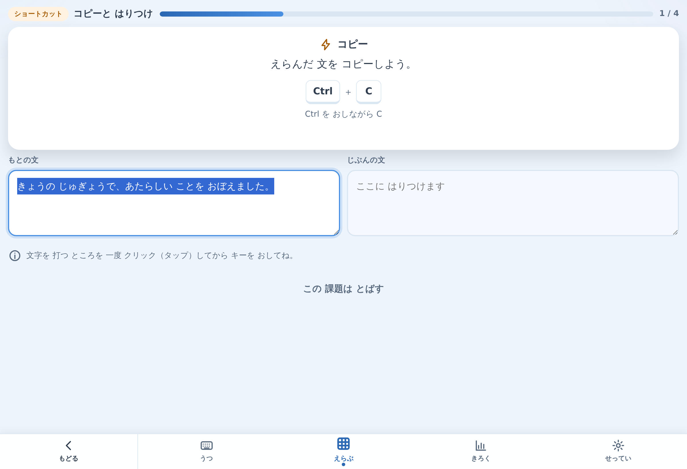

キーを おしただけでは 合かくに なりません。<ruby>結果<rt>けっか</rt></ruby>が 正しいかを 見て います。

4つ ぜんぶ できると、けっかの <ruby>画面<rt>がめん</rt></ruby>に かわります。

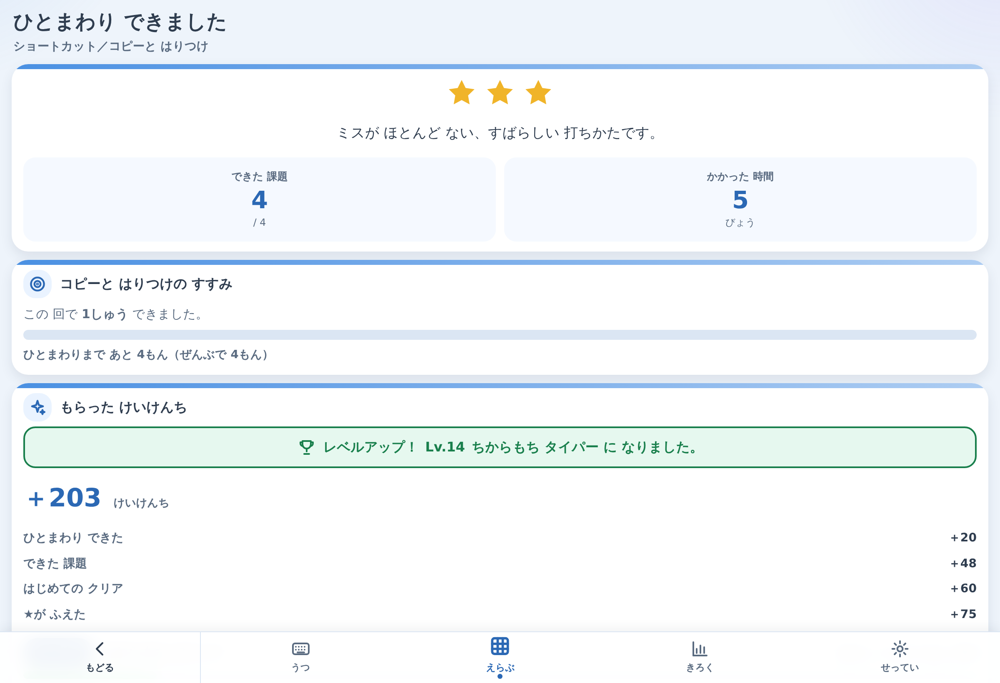

できた <ruby>課題<rt>かだい</rt></ruby>の 数と、かかった 時間が 出ます。

【！】おぼえて おいて ほしい こと

- どうしても できない ときは、下の「この <ruby>課題<rt>かだい</rt></ruby>は とばす」を おせます。
- `Ctrl` の かわりに Chromebook の けんさくキーを つかう ものも あります。<ruby>画面<rt>がめん</rt></ruby>に 書いて あるので、その とおりに おして ください。
- ここで おぼえた キーは、ほかの アプリでも そのまま つかえます。

## ぜんぶ ★3つに なった あと（だん）

★は 正かくさで つくので、ぜんぶ ★3つに なった 人には それいじょう のびが 見えません。その さきの 目じるしが「だん」です。

### だんは どうすると 上がるか

だんは、ヒントを 1つ <ruby>消<rt>け</rt></ruby>した ままで はやさの めやすに とどくと 上がります。1だんから 3だんまで あります。

1. 1だん … ヒントを「ゆびの 色だけ」いじょうに して、2.0 <ruby>打<rt>だ</rt></ruby>／びょう。
2. 2だん … ヒントを「ばしょだけ」いじょうに して、3.0 <ruby>打<rt>だ</rt></ruby>／びょう。
3. 3だん … ヒントを「なにも 出ない」いじょうに して、4.0 <ruby>打<rt>だ</rt></ruby>／びょう。

どれも、ひとまわりの ★が 3つの ときだけ 上がります。まちがえても はやければ よい、に ならない ように する ためです。★と 同じで、<ruby>一度<rt>いちど</rt></ruby> 上がった だんは 下がりません。

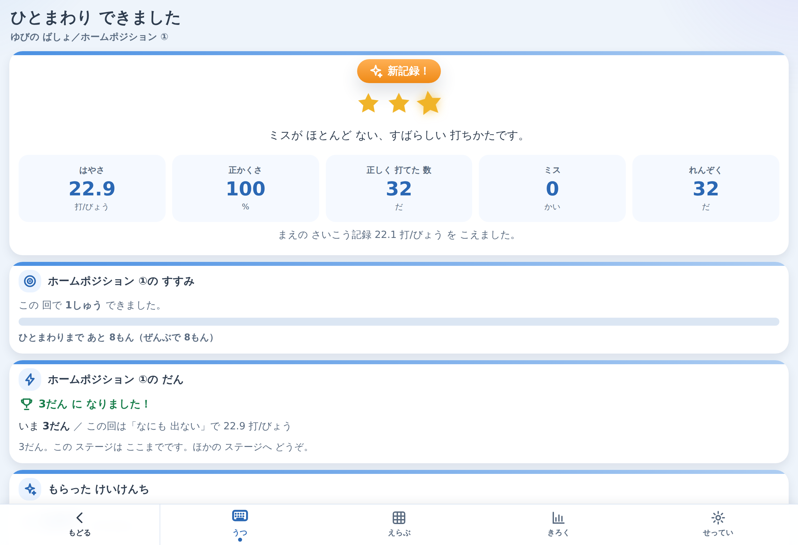

だんが 上がると、けっかの <ruby>画面<rt>がめん</rt></ruby>に その しらせが 出ます。

### そのさきの すすみかた

ぜんぶの ステージが ★3つに なると、アプリの 出しかたが かわります。「えらぶ」の <ruby>画面<rt>がめん</rt></ruby>と ひらいた ときの お<ruby>題<rt>だい</rt></ruby>が「そのさき」に かわり、だんの いちばん ひくい ステージから 出るように なります。同じ ステージばかりに ならない ように、長く さわって いない ものから えらばれます。

この ときから、<ruby>打<rt>う</rt></ruby>つ <ruby>画面<rt>がめん</rt></ruby>に はやさの めやすが 出ます。それまで 出さないのは、まだ ★を あつめて いる とちゅうの 人が、正かくさより はやさを おいかけて しまわない ように する ためです。じゅんばんは いつも、正かくさが 先で、はやさは その 上です。

だんの カードは、けっかの <ruby>画面<rt>がめん</rt></ruby>で つぎの だんまで 何が 足りないかも 教えて くれます。ヒントを へらすのが 足りないのか、はやさが 足りないのか、それとも ひとまわりの ★が 3つに なって いないのかが、その ばで 分かります。

3だんまで 上がった ステージは、それいじょう 上がりません。ほかの ステージで だんを 上げて いきましょう。

## じぶんの きろくを 見る（下の バーの「きろく」）

下の バーの「きろく」を おすと、これまでの あゆみが 見られます。上に レベルと れんぞく日数、その 下に 4つの ひきだしが ならびます。

### きょう … きょう どれだけ <ruby>打<rt>う</rt></ruby>ったか

はじめに ひらくのが「きょう」です。その日 どれだけ <ruby>打<rt>う</rt></ruby>ったかが、3つの 数字で 出ます。

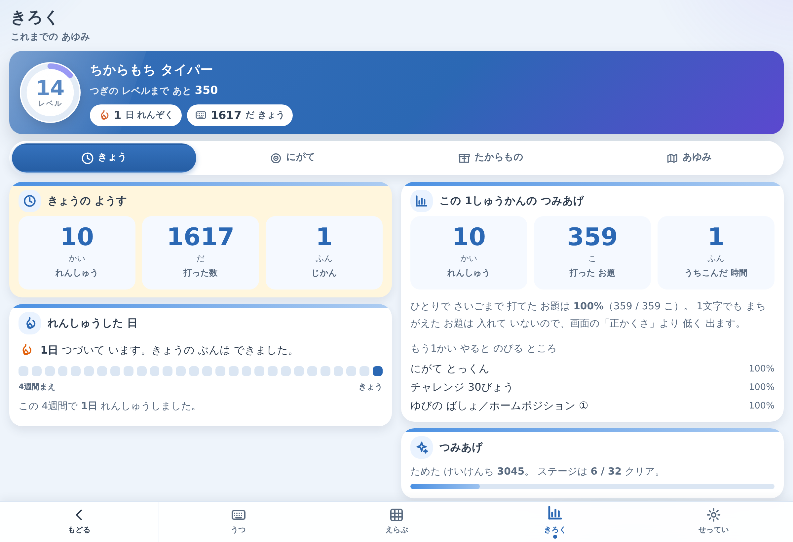

きょうの 回数・<ruby>打<rt>う</rt></ruby>った数・時間と、れんしゅうした 日の カレンダーが 出ます。

れんしゅうした 日の ところは、4週間ぶんの まるが ならびます。つづけて いる 日数も ここで 分かります。

### にがて … キーボードの 色で にがてを 見る

「にがて」を おすと、キーボードの 絵に これまでの まちがいが 色で 出ます。どの あたりが まだ 手に なじんで いないかが、ひと目で 分かります。

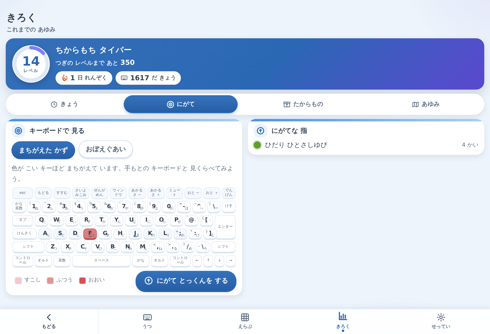

まちがえた 回数の おおい キーほど、こい 色に なります。

上の 2つの ボタンで、「まちがえた かず」と「おぼえぐあい」を 切りかえられます。下には、手が 止まりやすい キーと、まちがえやすい ローマ字の きまりが ならびます。ここから そのまま「にがて とっくんを する」を おせます。

### たからもの … バッジと ステージの ★

「たからもの」は、これまでに あつめた ものを ならべる ところです。

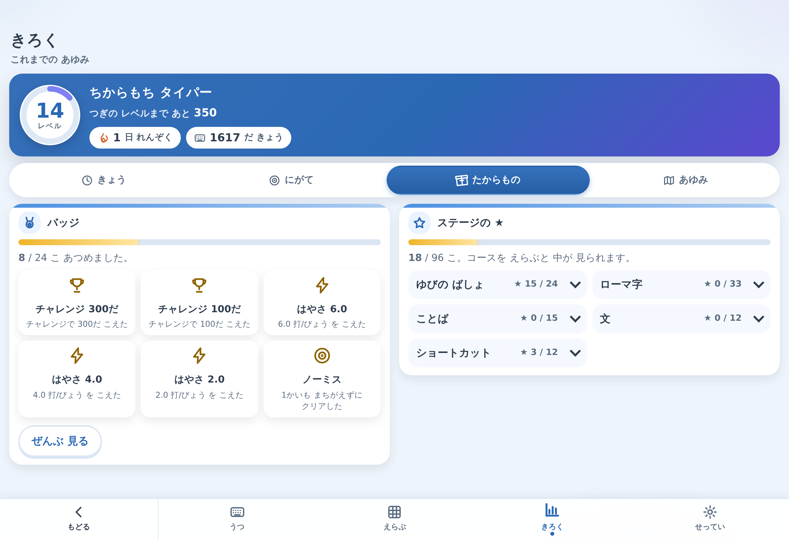

コースごとの ★の 数と、もらった バッジが 出ます。

「ぜんぶ 見る」を おすと、24しゅるいの バッジが ぜんぶ ならびます。

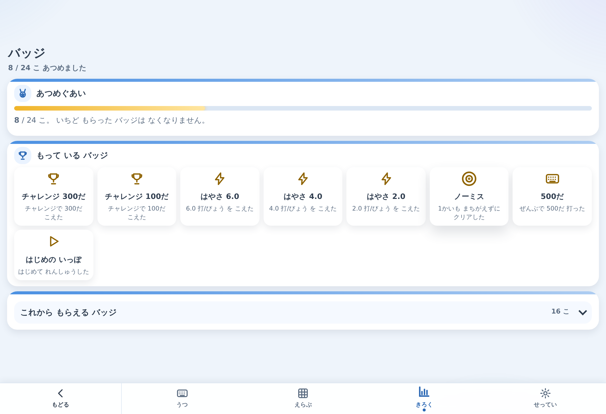

まだ もらって いない バッジは、うすい 色で 出ます。

バッジは、はじめて <ruby>打<rt>う</rt></ruby>った とき、まちがえずに クリアした とき、何日か つづけた とき、はやさが 上がった ときなどに もらえます。

### あゆみ … さいこう<ruby>記録<rt>きろく</rt></ruby>と はやさの うつりかわり

「あゆみ」には、さいこう<ruby>記録<rt>きろく</rt></ruby>・はやさの グラフ・チャレンジの きろく・さいきんの れんしゅうが、上から じゅんに ならびます。

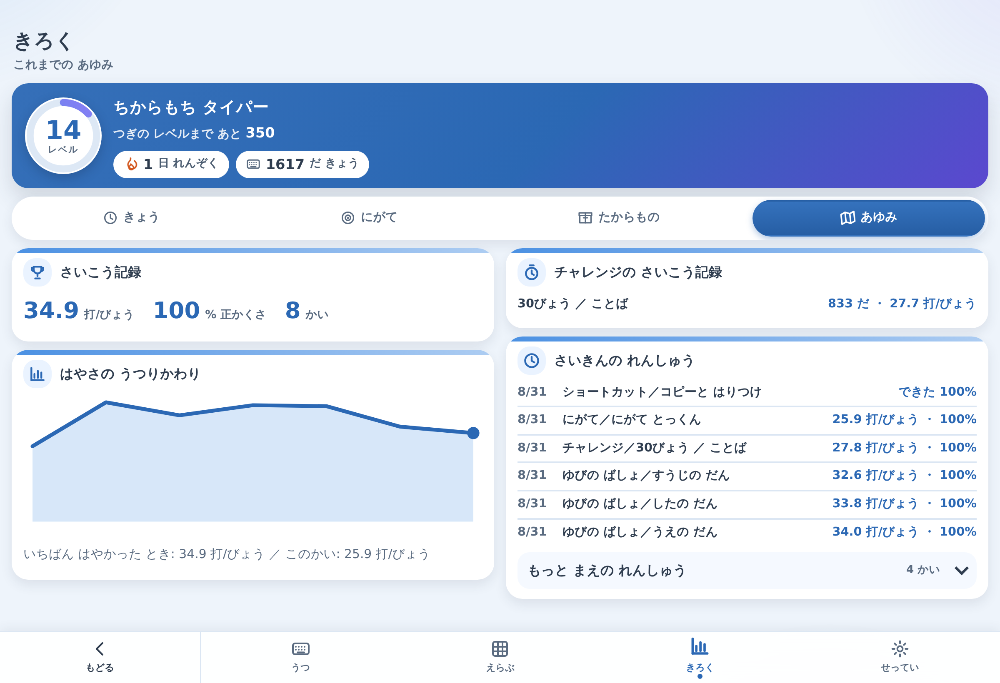

いちばん 上が さいこう<ruby>記録<rt>きろく</rt></ruby>です。

グラフを 見ると、はやさが すこしずつ 上がって いるかが 分かります。1日で かわる ものでは ないので、1週間ぐらいの ながさで 見て ください。

いちばん 下の「さいきんの れんしゅう」には、1回ぶんずつの きろくが ならびます。「もっと まえの れんしゅう」を ひらくと、40回ぶんまで さかのぼれます。

## ヒントの つよさを かえる（せってい →「ヒント」）

なれて きたら、ヒントを 少しずつ 弱く します。そうすると、手もとを 見ないで <ruby>打<rt>う</rt></ruby>てるように なって いきます。

### ヒントの つよさを 5つから えらぶ

下の バーの「せってい」を おすと、はじめに「ヒント」の ひきだしが ひらきます。

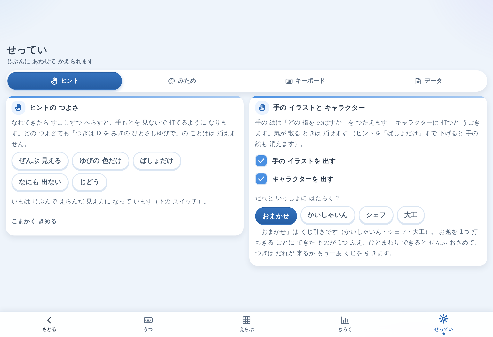

上の 5つの ボタンから、ヒントの つよさを えらびます。

1. ぜんぶ 見える … キーボードも 文字も ゆびの 色も ぜんぶ 出ます。
2. ゆびの 色だけ … キーの 文字が <ruby>消<rt>き</rt></ruby>えます。
3. ばしょだけ … ゆびの 色分けも <ruby>消<rt>き</rt></ruby>えます。
4. なにも 出ない … <ruby>画面<rt>がめん</rt></ruby>の キーボードが <ruby>消<rt>き</rt></ruby>えます。
5. じどう … おぼえぐあいに あわせて、はじめる ときに アプリが きめます。

どの つよさでも、「つぎは D を みぎの ひとさしゆびで」の ことばは <ruby>消<rt>き</rt></ruby>えません。絵が <ruby>消<rt>き</rt></ruby>えても、どの ゆびかは かならず ことばで つたわります。

### こまかく きめる

「こまかく きめる」を おすと、中の 4つの スイッチを 1つずつ 切りかえられます。

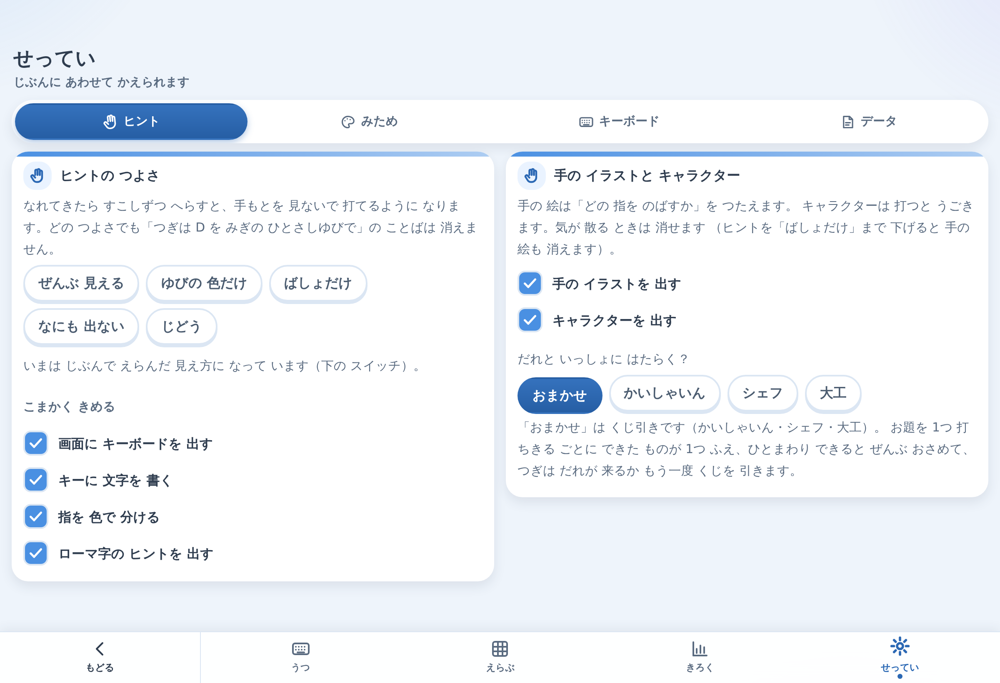

スイッチが 4つ ならびます。

ここを さわると、上の つよさは「じぶんで」に かわります。

同じ <ruby>画面<rt>がめん</rt></ruby>の 下では、手の イラストと キャラクターを <ruby>消<rt>け</rt></ruby>せます。キャラクターの しごと（かいしゃいん・シェフ・大工）を えらんで、いつも 同じ キャラクターに する ことも できます。

## 見た目と 音を かえる（せってい →「みため」）

まぶしい ときや、字が 小さくて 読みにくい ときは、ここで かえられます。

### <ruby>画面<rt>がめん</rt></ruby>の 色を かえる

「みため」の ひきだしを ひらくと、いちばん 上に <ruby>画面<rt>がめん</rt></ruby>の 色が あります。

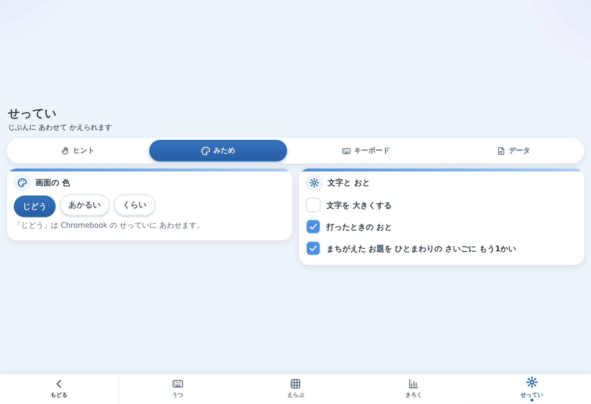

あかるい・くらい・じどうの 3つから えらびます。

「じどう」は、Chromebook そのものの せっていに あわせます。「くらい」を えらぶと、<ruby>打<rt>う</rt></ruby>つ <ruby>画面<rt>がめん</rt></ruby>も <ruby>暗<rt>くら</rt></ruby>い 色に なります。

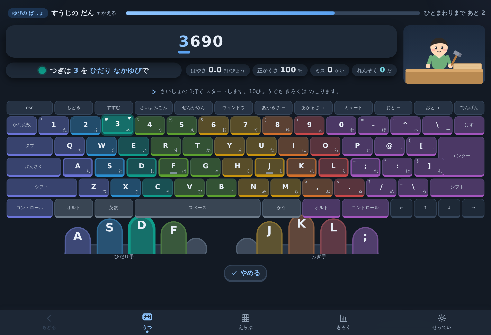

<ruby>暗<rt>くら</rt></ruby>い ところでも まぶしく ありません。

### 文字の 大きさ・おと・<ruby>打<rt>う</rt></ruby>ち直し

同じ ひきだしの 下に、3つの スイッチが あります。

1. 文字を 大きくする … お<ruby>題<rt>だい</rt></ruby>も <ruby>画面<rt>がめん</rt></ruby>の 文字も 大きく なります。<ruby>電子黒板<rt>でんしこくばん</rt></ruby>に うつす ときにも つかえます。
2. <ruby>打<rt>う</rt></ruby>ったときの おと … <ruby>打<rt>う</rt></ruby>つ ときの 音を <ruby>消<rt>け</rt></ruby>せます。
3. まちがえた お<ruby>題<rt>だい</rt></ruby>を ひとまわりの さいごに もう1かい … ひとまわりの あとの <ruby>打<rt>う</rt></ruby>ち直しを 止められます。

もっと 大きく したい ときは、ブラウザの <ruby>拡大<rt>かくだい</rt></ruby>（`Ctrl` と `+`）も つかえます。Typa は <ruby>拡大<rt>かくだい</rt></ruby>を 止めて いないので、タブレットの ピンチ<ruby>操作<rt>そうさ</rt></ruby>も そのまま つかえます。

「まちがえた お<ruby>題<rt>だい</rt></ruby>を ひとまわりの さいごに もう1かい」は、はじめから 入って います。ひとまわりする たびに、その 中で つまずいた お<ruby>題<rt>だい</rt></ruby>を もう1回だけ 出す しくみです。切ると、ひとまわりした ところで すぐ つぎの <ruby>周<rt>しゅう</rt></ruby>に すすみます。

【！】おぼえて おいて ほしい こと

- 紙ふぶきなどの <ruby>演出<rt>えんしゅつ</rt></ruby>を アプリの せっていで 止める ことは できません。<ruby>端末<rt>たんまつ</rt></ruby>の「<ruby>視差効果<rt>しさこうか</rt></ruby>を<ruby>減<rt>へ</rt></ruby>らす」（アニメーションを<ruby>減<rt>へ</rt></ruby>らす）が 入って いれば、Typa が じどうで したがいます。
- うごきや 音が 気に なる ときは、「ヒント」の キャラクターを 出すを 切り、ここの <ruby>打<rt>う</rt></ruby>ったときの おとを 切ると、かなり へります。
- 色が 見分けにくい ときも だいじょうぶです。まちがえた ことは、色だけで なく「ミス」の 数字と、お<ruby>題<rt>だい</rt></ruby>の わくでも 分かります。Windows の ハイコントラストの せっていにも あわせて あります。

## キーボードの ならびを 合わせる（せってい →「キーボード」）

<ruby>打<rt>う</rt></ruby>った 文字と ちがう 字が 出る ときは、たいてい ここが 合って いません。

### <ruby>日本語配列<rt>にほんごはいれつ</rt></ruby>（JIS）と <ruby>英語配列<rt>えいごはいれつ</rt></ruby>（US）

「キーボード」の ひきだしを ひらくと、いちばん 上に ならびの えらびかたが あります。

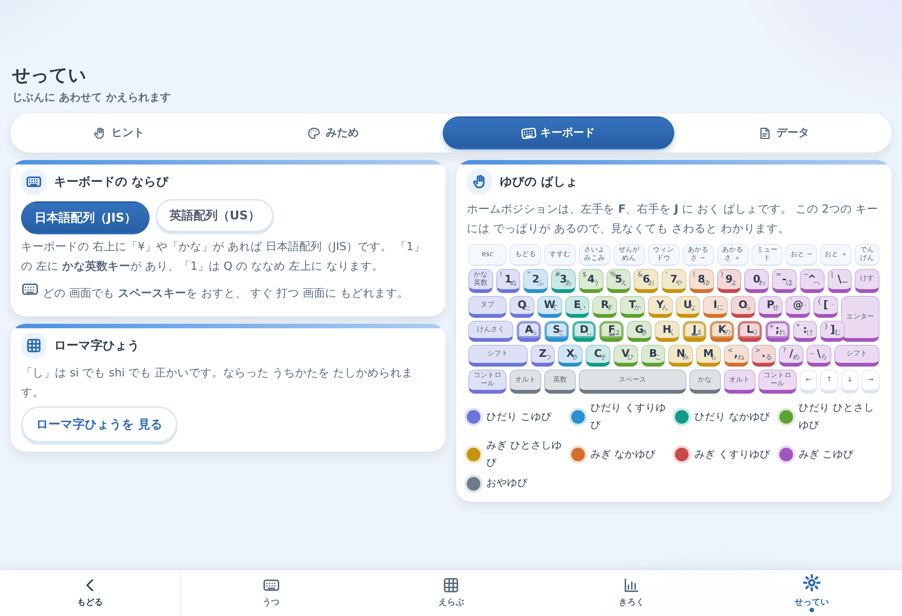

<ruby>日本語配列<rt>にほんごはいれつ</rt></ruby>（JIS）と <ruby>英語配列<rt>えいごはいれつ</rt></ruby>（US）の どちらかを えらびます。

キーボードの 右上に「¥」や「かな」が あれば <ruby>日本語配列<rt>にほんごはいれつ</rt></ruby>（JIS）です。「1」の 左に かな<ruby>英数<rt>えいすう</rt></ruby>キーが あり、「1」は Q の ななめ 左上に あります。

### ゆびの ばしょを たしかめる

同じ ひきだしの 下に、ホームポジションと ゆびの 色の 図が あります。

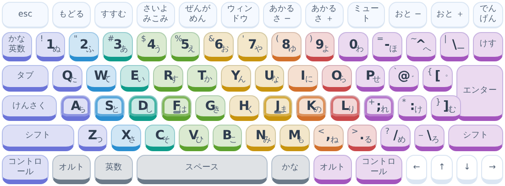

どの キーを どの ゆびで おすかを、色で 見られます。

この 図は 見る ためだけの ものです。おしても <ruby>打<rt>う</rt></ruby>つ ことには なりません。

### ローマ字ひょうで <ruby>打<rt>う</rt></ruby>ちかたを たしかめる

「ローマ字ひょうを 見る」を おすと、うけつける <ruby>打<rt>う</rt></ruby>ちかたの <ruby>一覧<rt>いちらん</rt></ruby>が ひらきます。

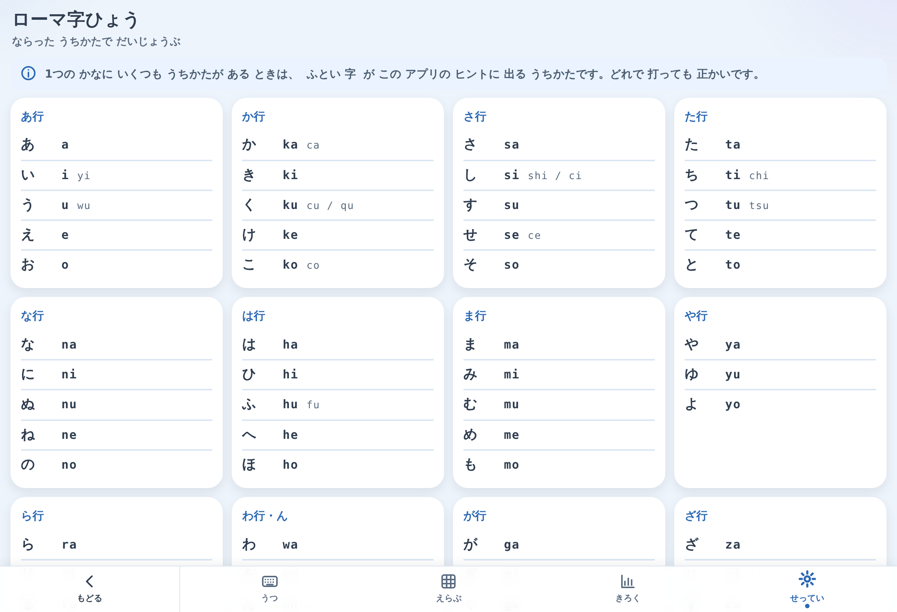

1つの かなに いくつも <ruby>打<rt>う</rt></ruby>ちかたが ある ものが ならびます。

「し」は si でも shi でも 正かいです。「じゃ」は ja でも zya でも <ruby>打<rt>う</rt></ruby>てます。ならった うちかたで だいじょうぶ、と いう ことを ここで たしかめられます。

## きろくを べつの <ruby>端末<rt>たんまつ</rt></ruby>へ うつす・ぜんぶ けす（せってい →「データ」）

学年が かわって Chromebook が 入れかわる ときは、きろくを ファイルに して もって いけます。

### 【！】きろくを ファイルに 書き出す

「せってい」→「データ」→「書き出し・読みこみ」と おします。

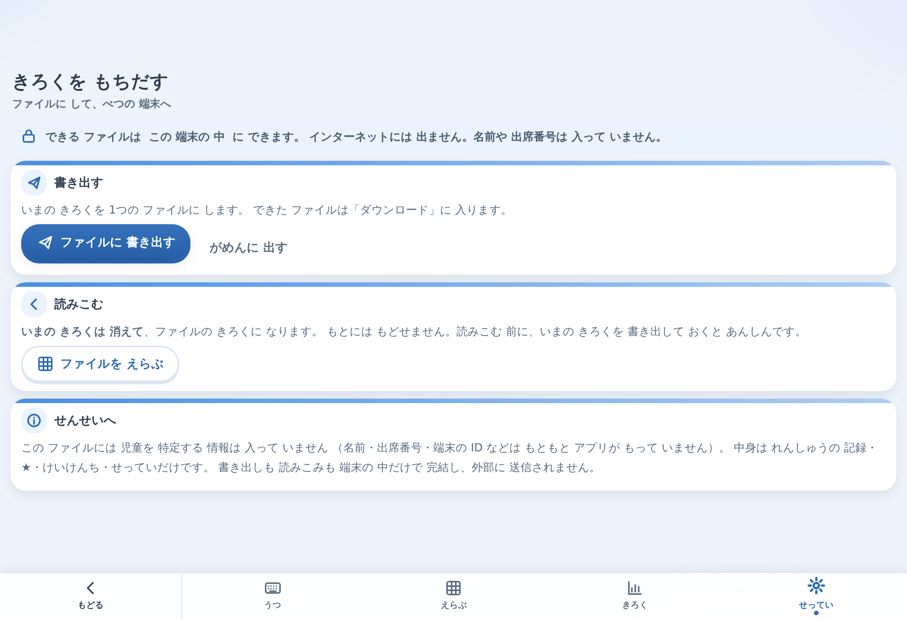

上が 書き出し、下が 読みこみです。

書き出しの <ruby>手順<rt>てじゅん</rt></ruby>:

1. 「ファイルに 書き出す」を おします。できた ファイルは「ダウンロード」に 入ります。
2. ダウンロードが つかえない ときは「がめんに 出す」を おします。文字に なって 出るので、ぜんぶ えらんで コピーします。
3. できた ファイルを、USB メモリや クラウドで 新しい <ruby>端末<rt>たんまつ</rt></ruby>に うつします。

【！】おぼえて おいて ほしい こと

- できる ファイルは その <ruby>端末<rt>たんまつ</rt></ruby>の 中に できます。インターネットには 出ません。
- 名前や <ruby>出席<rt>しゅっせき</rt></ruby>ばんごうは 入って いません。
- 書き出しも 読みこみも、`Tab` キーと エンターキーだけで できます。マウスは いりません。

### 書き出した ファイルを 読みこむ

新しい <ruby>端末<rt>たんまつ</rt></ruby>で Typa を ひらき、同じ <ruby>画面<rt>がめん</rt></ruby>の「ファイルを えらぶ」から 書き出した ファイルを えらびます。読みこむ 前に、<ruby>中身<rt>なかみ</rt></ruby>（れんしゅうの 回数・★の 数・けいけんち・さいごの 日）が 出るので、たしかめてから すすめて ください。

読みこむと、いまの きろくは <ruby>消<rt>き</rt></ruby>えて、ファイルの きろくに なります。2つの きろくは まざりません。もとには もどせないので、読みこむ 前に いまの きろくを 書き出して おくと あんしんです。

### 【！！】きろくを ぜんぶ けす

「せってい」→「データ」の いちばん 下に「きろくを ぜんぶ けす」が あります。

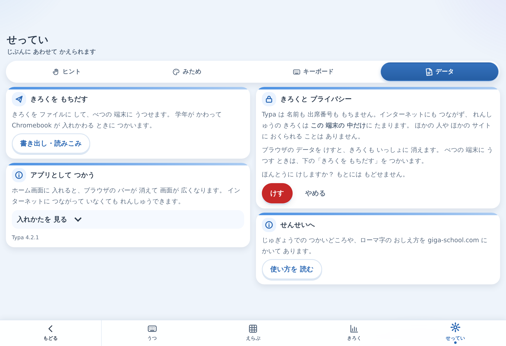

「ほんとうに けしますか？」と 出て、2回 たしかめます。

<ruby>消<rt>き</rt></ruby>えるのは、★・れんしゅうの きろく・レベルと バッジ・チャレンジの きろくです。ヒントの つよさや キーボードの ならびなどの せっていは のこります。

<ruby>一度<rt>いちど</rt></ruby> <ruby>消<rt>け</rt></ruby>すと もとには もどせません。とっておきたい ときは、けす 前に かならず ファイルに 書き出して ください。

## うまく いかない ときは

こまった ときは、まず ここを 見て ください。おおい ものから ならべて あります。

### キーを おしても すすまない とき

日本語入力（かな入力）に なって いないか たしかめて ください。かな<ruby>英数<rt>えいすう</rt></ruby>キー（「1」の 左）か <ruby>英数<rt>えいすう</rt></ruby>キー（スペースの 左）を 1回 おしてから <ruby>打<rt>う</rt></ruby>ちます。

<ruby>打<rt>う</rt></ruby>った 文字と ちがう 字が 出る ときは、せってい →「キーボード」の ならびが <ruby>端末<rt>たんまつ</rt></ruby>と 合って いません。<ruby>日本語配列<rt>にほんごはいれつ</rt></ruby>と <ruby>英語配列<rt>えいごはいれつ</rt></ruby>を 合わせて ください。

### <ruby>画面<rt>がめん</rt></ruby>が まっしろの まま、または 出ない とき

いちど アプリを ぜんぶ とじて、ひらき直して ください。Typa は 外の サイトを 1つも 読まないので、学校の フィルタリングで 止まる ことは ありません。

「インターネットに つながって いません」と 出た ときは、まだ <ruby>一度<rt>いちど</rt></ruby>も アプリを <ruby>取<rt>と</rt></ruby>れて いない <ruby>端末<rt>たんまつ</rt></ruby>です。つながる ところで いちど ひらいて ください。

### 「あたらしい ばんが あります」と 出た とき

<ruby>画面<rt>がめん</rt></ruby>に <ruby>帯<rt>おび</rt></ruby>が 出たら「さいしんに する」を おして ください。おすまで 切りかわりません。<ruby>打<rt>う</rt></ruby>って いる とちゅうに <ruby>画面<rt>がめん</rt></ruby>が <ruby>消<rt>き</rt></ruby>えない ように して あります。

### きろくが きえて しまった とき

ブラウザの データを <ruby>消<rt>け</rt></ruby>すと、きろくも いっしょに <ruby>消<rt>き</rt></ruby>えます。iPad や iPhone の Safari は、7日 ひらかないと <ruby>消<rt>き</rt></ruby>える ことが あります。ホーム<ruby>画面<rt>がめん</rt></ruby>に <ruby>追加<rt>ついか</rt></ruby>して おくと <ruby>消<rt>き</rt></ruby>えにくく なります。

書き出した ファイルが あれば、読みこんで もどせます。

### べつの 人の きろくが 出て いる とき

同じ <ruby>端末<rt>たんまつ</rt></ruby>を みんなで つかって います。Typa は <ruby>端末<rt>たんまつ</rt></ruby>ごとに 1つの きろくを もつので、人ごとに 分ける ときは ブラウザの プロフィールを 分けて ください。

### それでも 直らない とき

まず、この アプリを 教えて くれた 先生か、じょうほうの 先生に 聞いて ください。いちばん 早く かいけつします。

それでも 分からない ときは、この ページの いちばん 下に ある <ruby>問<rt>と</rt></ruby>い合わせ先から しらせて ください。

## 先生へ（クラスで つかう ときと、<ruby>印刷<rt>いんさつ</rt></ruby>）

ここは 先生むけの ところです。ふだん つかう ぶんには、読まなくて だいじょうぶです。

### はじめる まえの じゅんび

1. さいしょの 1回だけ、インターネットに つないで ひらいて ください。その ときに アプリ<ruby>一式<rt>いっしき</rt></ruby>が <ruby>端末<rt>たんまつ</rt></ruby>に 入り、つぎからは <ruby>圏外<rt>けんがい</rt></ruby>でも つかえます。
2. 40人が <ruby>一斉<rt>いっせい</rt></ruby>に ひらいても だいじょうぶです。<ruby>通信<rt>つうしん</rt></ruby>を しない アプリなので、校内 Wi-Fi の こみぐあいに 左右されません。
3. ヒントの つよさは <ruby>児童<rt>じどう</rt></ruby>ごとに ちがって かまいません。せっていは <ruby>端末<rt>たんまつ</rt></ruby>に のこるので、毎回 合わせ直す ひつようは ありません。

### きろくが のこる ばしょ

れんしゅうの きろみは、その <ruby>端末<rt>たんまつ</rt></ruby>の ブラウザの 中だけに たまります。名前・<ruby>出席番号<rt>しゅっせきばんごう</rt></ruby>・メールアドレスは 一切 あつかいません。<ruby>通信<rt>つうしん</rt></ruby>を する コードが そもそも 入って いません。

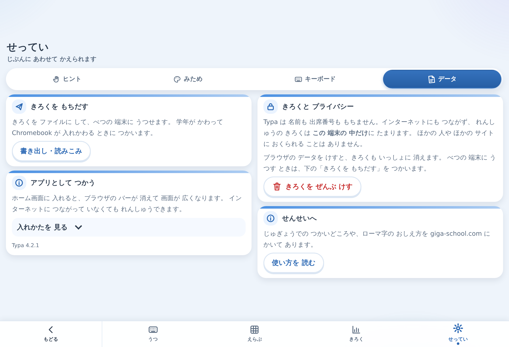

アプリの ばんごうと、ホーム<ruby>画面<rt>がめん</rt></ruby>に 入れる ボタンも ここに あります。

<ruby>端末<rt>たんまつ</rt></ruby>を 入れかえる ときは、上の「きろくを べつの <ruby>端末<rt>たんまつ</rt></ruby>へ うつす」の <ruby>手順<rt>てじゅん</rt></ruby>で ファイルに して ください。<ruby>学期<rt>がっき</rt></ruby>の <ruby>区切<rt>くぎ</rt></ruby>りで 書き出して おくと あんしんです。

### ローマ字ひょうを 紙に して <ruby>配<rt>くば</rt></ruby>る

Typa は <ruby>印刷<rt>いんさつ</rt></ruby>して つかう アプリでは ありませんが、ローマ字ひょうは 紙に して <ruby>配<rt>くば</rt></ruby>れます。

<ruby>印刷<rt>いんさつ</rt></ruby>の <ruby>手順<rt>てじゅん</rt></ruby>:

1. せってい →「キーボード」→「ローマ字ひょうを 見る」を ひらきます。
2. `Ctrl` と `P`（Mac は `⌘` と `P`）を おします。
3. 下の バーと ボタンは <ruby>印刷<rt>いんさつ</rt></ruby>では <ruby>自動<rt>じどう</rt></ruby>で <ruby>消<rt>き</rt></ruby>えます。<ruby>表<rt>ひょう</rt></ruby>が ページを またいで <ruby>割<rt>わ</rt></ruby>れて いないかを たしかめて ください。
4. 用紙は A4 たて、よゆう 12mm が はじめの せっていです。

【！】おぼえて おいて ほしい こと

- <ruby>紙面<rt>しめん</rt></ruby>として きれいに <ruby>整<rt>ととの</rt></ruby>える <ruby>設計<rt>せっけい</rt></ruby>は まだ して いません。気に なる ときは、いったん PDF に 出して 見て ください。
- <ruby>児童<rt>じどう</rt></ruby>に <ruby>配<rt>くば</rt></ruby>る ときは、ならって いない <ruby>打<rt>う</rt></ruby>ちかたも のって いる ことを ひとこと <ruby>伝<rt>つた</rt></ruby>えて おくと まよいません。
